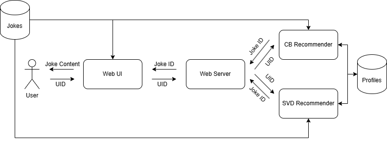

# joke-recommendation

Full-stack application for joke recommendation.

## Data used

To build our models, we used [Jester Dataset](https://eigentaste.berkeley.edu/dataset/).

## Project structure

The project is split into several submodules:
- `ui`: Web UI and server
- `recommendation`: Implementation of recommender systems
- `utils`: various common scripts
- `explain`: evaluation and explanation

Besides those, there is `data` folder present containing evaluation and training data. There is also `data_exploration.ipynb` interactive Python notebook notebook containing initial data analysis.

## System Dependencies

To run the project, you need the following programs to have installed:
- Python Interpreter (at least `3.12`) with package manager (ideally `pip`)
- NodeJS with package manager (ideally `npm`)
- Web Browser (tested on Chrome)

## Project Dependencies

To install python dependencies, run the following:

```bash
pip install -r requirements.txt
```

To install Web UI dependencies, navigate to `ui/frontend/jokes-ui` and run:

```bash
npm install
```

## Architecture


## Interface


